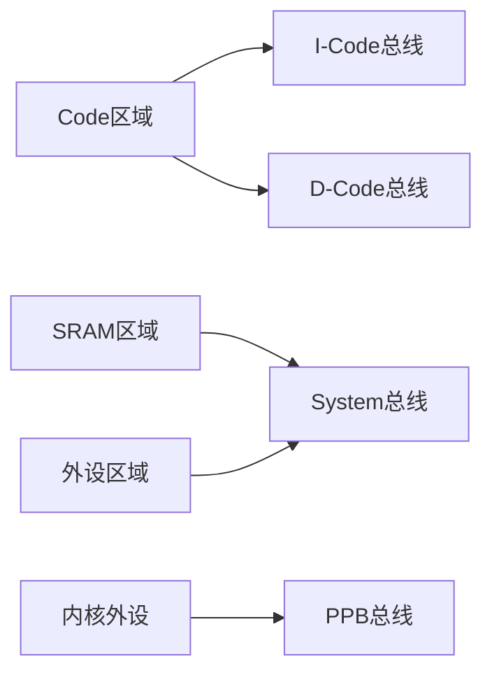
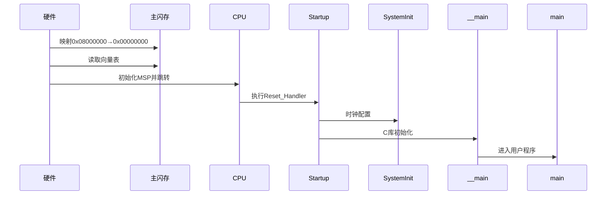
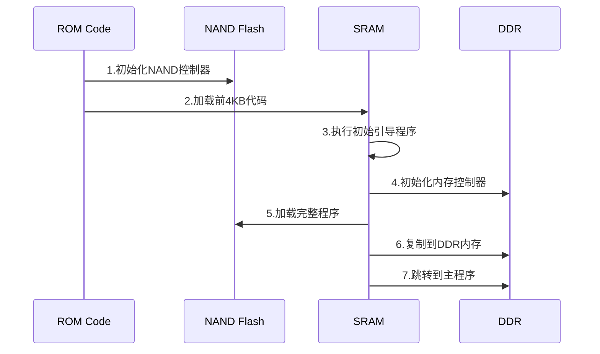
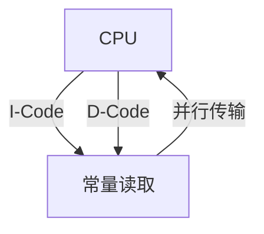
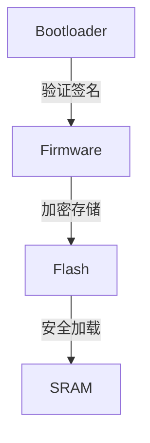

## 1. 硬件读取BOOT引脚

​**BOOT0 和 BOOT1 的作用**​

BOOT0 和 BOOT1 引脚的不同组合决定了芯片启动时映射到 `0x00000000` 的存储器区域。具体组合如下：

|BOOT1|BOOT0|启动模式|映射到 `0x00000000` 的存储器区域|物理介质类型|
|---|---|---|---|---|
|x|0|主闪存（Main Flash）启动|主闪存起始地址 `0x08000000`|内部NOR Flash|
|0|1|系统存储器（System Memory）启动|系统存储器起始地址 `0x1FFF0000`|内部NOR Flash|
|1|1|内置 SRAM 启动|内置 SRAM 起始地址 `0x20000000`|SRAM|

​**关键特性对比**​：

- ​**主闪存**​：可读写NOR Flash，存储用户程序
- ​**系统存储器**​：只读NOR Flash，存储厂商Bootloader，也称bootROM
- ​**内置SRAM**​：易失性存储器，需预先加载代码

​**硬件启动逻辑的作用**​：

- 仅根据BOOT引脚电平进行存储器映射
- 不区分Bootloader和用户程序
- 映射完成后立即从0x00000000开始执行

## 2. MCU总线与存储器架构

### 2.1 Cortex-M存储器映射



### 2.2 总线架构详解

1. ​**I-Code总线**​：

    - 专用于指令取指和向量表读取
    - 支持突发传输和预取优化
    - 只读访问，不可写
2. ​**D-Code总线**​：

    - 用于常量数据访问（.const段）
    - 支持读写操作
    - 与I-Code并行工作提高效率
3. ​**System总线**​：

    - 处理SRAM和外设访问
    - 支持所有读写操作
    - 带宽低于I/D-Code

### 2.3 存储器访问特性

```c
// 不同存储区域的访问方式
void *code_ptr = (void*)0x08001234; // I-Code访问（指令）
const uint32_t *data_ptr = (uint32_t*)0x08005678; // D-Code访问（常量）
volatile uint32_t *reg_ptr = (uint32_t*)0x40021000; // System访问（外设）
```

## 3. 三种不同启动模式的区别

### 3.1 启动中的关键组件

#### 中断向量表

​**Cortex-M架构规范**​：

```c
typedef struct {
    uint32_t initial_sp;    // 初始堆栈指针
    void (*reset_handler)(void); // 复位处理函数
    void (*nmi_handler)(void);   // NMI处理函数
    // ...其他中断向量
} VectorTable;
```


#### Bootloader

​**功能分类**​：

1. ​**内置Bootloader**​（系统存储器中）：

    - 支持USART/USB/CAN等接口的固件更新
    - 提供有限的硬件初始化
2. ​**自定义Bootloader**​（用户Flash中）：

    - 支持OTA升级
    - 可包含加密验证功能
    - 提供更完整的硬件初始化

#### Startup File

​**典型启动文件流程**​（startup_stm32fxxx.s）：

```c
Reset_Handler:
    LDR     R0, =__initial_sp    ; 再次初始化SP
    MSR     MSP, R0
    BL      SystemInit           ; 系统时钟初始化
    BL      __main               ; C库初始化
    B       main                ; 跳转到用户程序
```

### 3.2 启动模式详细流程

#### 从主闪存启动（BOOT0=0）

​**执行流程图**​：



#### 从系统存储器启动（BOOT0=1, BOOT1=0）

​**特殊考虑**​：

- 内置Bootloader通常不初始化所有外设
- 跳转到用户程序前需手动配置：

    ```c
    void jump_to_app(uint32_t app_addr) {
        __disable_irq();
        SCB->VTOR = app_addr;
        __set_MSP(*(uint32_t*)app_addr);
        ((void(*)(void))*(uint32_t*)(app_addr+4))();
    }
    ```


#### 从内置SRAM启动（BOOT0=1, BOOT1=1）

​**代码加载方式**​：

1. 通过调试器直接写入
2. 通过其他Bootloader加载：

    ```c
    void load_to_sram(uint8_t *src, uint32_t size) {
        memcpy((void*)0x20000000, src, size);
        __DSB(); // 确保数据同步
    }
    ```


#### 从外部NAND Flash/SD卡启动

这种方式比较特殊，实际上还是一般还是从系统存储器（bootROM）启动，这里存储了bootloader，将bootloader的关键部分（至少要到初始化外部flash的部分）载入

​**特殊启动流程**​：



​**关键限制**​：

- NAND Flash无法直接执行代码(XIP)
- 必须通过SRAM中转加载
- 需要专用控制器处理坏块和ECC


### 3.3 启动模式对比总结

| 特性           | 主闪存启动     | 系统存储器启动   | SRAM启动  | 外部NAND启动 |
| ------------ | --------- | --------- | ------- | -------- |
| ​**执行位置**​   | NOR Flash | NOR Flash | SRAM    | DDR/SRAM |
| ​**是否需要加载**​ | 否         | 否         | 是       | 是        |
| ​**XIP支持**​  | 是         | 是         | 是       | 否        |
| ​**典型用途**​   | 正常运行模式    | 固件更新模式    | 调试/特殊模式 | 大容量系统    |

## 4. Cortex-M与Cortex-A启动对比

​**关键差异**​：

|特性|Cortex-M|Cortex-A|
|---|---|---|
|​**向量表位置**​|固定地址|由OS动态设置|
|​**初始化主体**​|Startup File|Bootloader|
|​**典型Bootloader**​|简单（内置/自定义）|复杂（如U-Boot）|
|​**多阶段启动**​|可选|必需|
|​**MMU使用**​|无/简单MPU|必需|

## 5. 常见问题解答

​**Q1：中断向量表为何要两次初始化SP？​**​

- 硬件初始化：确保最早期的函数调用可用
- 软件初始化：允许动态调整堆栈位置和大小

​**Q2：NOR Flash和NAND Flash在启动中的本质区别？​**​

```c
// NOR Flash执行（直接访问）
void (*nor_func)() = (void(*)())0x08001234;
nor_func();

// NAND Flash执行（需加载）
memcpy(0x20001000, nand_data, size);
void (*nand_func)() = (void(*)())0x20001000;
nand_func();
```

​**Q3：总线矩阵如何提升性能？​**​



## 6. 补充技术细节

​**Flash加速技术**​：

- STM32 ART Accelerator：
    - 实现等效0等待周期执行
    - 128位预取缓冲机制

​**安全启动考虑**​：



## 7. 参考资料更新

1. [STM32Cube编程手册](https://www.st.com/resource/en/programming_manual/dm00046982.pdf)
2. [ARM Cortex-M权威指南](https://www.arm.com/resources/books/cortex-m-series)
3. [U-Boot官方文档](https://www.denx.de/wiki/U-Boot/Documentation)
4. [NAND Flash启动技术白皮书](https://www.micron.com/support/technical-notes)
5. [[ARM Cortex-M3 M4单片机启动流程]]
6. [配置系统从SRAM启动](https://edgeai-lab.github.io/notebook/Embedded%20System/MCU/master/mcu_boot_configure/#mcu)
7. [stm32启动方式汇总](https://blog.csdn.net/m0_74209072/article/details/144290468)